# ralph-brow 🤖🔁

<p align="center">
  
</p>

A [Claude Code skill](https://docs.claude.com/en/docs/claude-code/skills) that scaffolds the **Ralph autonomous build loop** into any project — ask a few questions, get a complete self-driving harness that builds your product task by task from a `prd.json` ledger.

Inspired by [Geoff Huntley's "Ralph Wiggum" technique](https://ghuntley.com/ralph/): run a stateless coding agent in a loop against a task ledger until everything passes.

## The loop

```
┌─────────────────────────────────────────────────────┐
│  ralph-continuous.sh  (supervisor: batches forever) │
│    └── ralph.sh N  (bounded loop)                   │
│          each iteration, a FRESH headless agent:    │
│          1. reads prd.json + progress.txt           │
│          2. picks FIRST task with passes=false      │
│          3. does ONLY that task (tests-first)       │
│          4. runs the task's own Verify steps        │
│          5. journals to progress.txt                │
│          6. flips passes → true                     │
│          7. commits · stops                         │
└─────────────────────────────────────────────────────┘
```

Statelessness is the trick: no conversation memory, no drift — every run re-reads the ledger and picks up exactly where the last one stopped. `progress.txt` is the durable memory; `prd.json` is the single source of truth. When every task passes, the loop emits `<promise>COMPLETE</promise>` and shuts itself down.

## Not the same thing as the `ralph-loop` plugin

Anthropic ships an official [ralph-loop plugin](https://claude.com/plugins/ralph-loop) — don't confuse the two, they solve different problems:

**ralph-loop** runs *inside your live Claude Code session*: a stop hook intercepts session exit and re-feeds your prompt (`/ralph-loop "fix this" --max-iterations 10`) until Claude outputs the completion promise. Same session, same context, Claude Code only, you at the keyboard. Perfect for hammering one gnarly task while you watch.

**ralph-brow** prepares the *codebase itself* to be autonomous: it interviews you into a validated `prd.json` ledger, then drops a shell harness into the repo that anything can drive — the Claude Code CLI, the Codex CLI, a custom provider, a cron job, another agent over SSH. Every iteration is a fresh stateless process; state lives in the repo (`prd.json`, `progress.txt`, git history); the whole thing runs detached in tmux overnight with quota pacing. Totally hands-off — the original Ralph Wiggum premise.

| | ralph-loop (official plugin) | ralph-brow (this) |
|---|---|---|
| Runs | inside your Claude Code session | anywhere — repo carries its own harness |
| Input | a prompt you write | spec interview → REQUIREMENTS.md → prd.json |
| Engine | Claude Code only | Claude Code CLI, Codex CLI, any custom provider |
| State | session context | repo artifacts: ledger, journal, commits |
| You | at the keyboard | asleep |

Use both: ralph-loop to iterate a single hard task in-session, ralph-brow to make the repo build itself while you're gone.

## Built with the loop

Two real, shipped projects whose codebases were built end-to-end by this harness — ledger in, product out (the `prd.json`, `progress.txt`, and ralph scripts are still sitting in each repo):

- **[agent-faces](https://github.com/fcavalcantirj/agent-faces)** — give your AI agent a talking, lip-syncing face: 12-emotion particle face, in-browser Whisper (WebGPU), bring-your-own-agent bridge. **70/70 tasks passed.**
- **[solvr](https://github.com/fcavalcantirj/solvr)** — an AI knowledge base where agents and humans build debugging knowledge together. **138/138 tasks passed**, on its *fifth-generation* ledger (`specs/prd-v5.json`) — the loop kept scaling as the PRD grew.

## Engines

The scaffolded harness is engine-agnostic — pick per run:

| Wrapper | Engine | Notes |
|---|---|---|
| `./ralph-claude.sh N` | Claude Code CLI (headless `claude -p`) | per-iteration token + cost accounting |
| `./ralph-codex.sh N` | Codex CLI (`gpt-5.6-sol`, reasoning max) | `codex exec`, sandboxed with network |
| `./ralph-<custom>.sh N` | Any Codex `model_provider` (e.g. Sakana fugu) | provider from `~/.codex/config.toml` |

`./ralph-continuous.sh <engine>` supervises: fixed-size batches, pauses between batches, automatic backoff on rate limits / 429 / 503, optional Telegram notifications, stops at 100%.

## Install

```bash
claude plugin marketplace add fcavalcantirj/ralph-brow
claude plugin install ralph-brow@ralph-brow
```

That's it — `/ralph-brow` is now available in every project.

### Contributing / local development

```bash
git clone https://github.com/fcavalcantirj/ralph-brow.git ~/dev/ralph-brow
ln -s ~/dev/ralph-brow/skills/ralph-brow ~/.claude/skills/ralph-brow
```

Symlinking the skill folder makes your edits live immediately, no reinstall.

## Use

In any project, inside Claude Code:

```
/ralph-brow
```

The skill checks your prerequisites (a valid `prd.json` ledger, installed CLIs, git state), asks 1–2 rounds of questions (project name, engines, golden rules, notifications), renders the harness from `templates/`, and verifies everything — without ever starting the loop itself. Then:

```bash
./ralph-claude.sh 1          # one task, watch it work
./ralph-continuous.sh codex  # hands off, go to sleep
```

## Running it overnight

Three rules, learned the hard way:

**1. Detach or die.** Never run the loop as a child of an agent session or a terminal that will close — it takes a SIGHUP when the parent tears down and dies at task 1 of 40. Run it in tmux:

```bash
tmux new-session -d -s ralph './ralph-continuous.sh claude >> ralph-continuous.log 2>&1'
tmux ls                        # still alive?
./progress.sh                  # how far along?
tmux kill-session -t ralph     # stop (prefer during a pause countdown)
```

The supervisor detects it's detached and logs one clean line per pause instead of animated countdowns.

**2. Pace for your usage windows.** Subscription plans meter a 5-hour rolling window *and* a weekly cap — an unpaced loop exhausts the first before midnight and spends the night in rate-limit backoff. Tune `BATCH_SIZE` and `BATCH_PAUSE_MINS` in `.env.ralph.local`:

```
tasks/hour ≈ BATCH_SIZE × 60 / (BATCH_SIZE × avg_task_mins + BATCH_PAUSE_MINS)
```

Starting point: `BATCH_SIZE=2`, `BATCH_PAUSE_MINS=30` → with ~10-min tasks, ≈2.4 tasks/hour, ~19 tasks across 8 hours — spread across the night instead of slammed into the first window. The built-in rate-limit backoff is reactive; proactive pauses are what preserve your weekly cap.

**3. Smoke before you sleep.** Run 1–2 *attended* iterations first and read the commit + journal entry before detaching. One supervised task catches a broken Verify step or missing API key in ten minutes; discovering it at 7am costs the night and the quota it burned retrying.

## Spec mode — no PRD? It builds one with you

The skill auto-detects where your project stands:

- **`prd.json` exists** → straight to scaffolding.
- **Requirements doc exists** (`REQUIREMENTS.md`, `PRD.md`, `SPEC.md`…) but no ledger → it offers to translate your requirements into `prd.json`, asking only about genuine gaps.
- **Nothing yet** → **spec mode**: a real product interview (it mines your repo and conversation first — no obvious questions), writes `REQUIREMENTS.md`, waits for your sign-off, then translates it into the ledger.

Generated ledgers follow [Anthropic's guidance for long-running agent harnesses](https://www.anthropic.com/engineering/effective-harnesses-for-long-running-agents): a strictly 4-field task schema (validated with `jq` before hand-off), end-to-end user-verifiable steps, initializer tasks first, one-session granularity (err toward more, smaller tasks), every task starting `passes: false`, and an immutable-ledger rule — the loop only ever flips `passes`.

## The ledger format

The ledger follows [Anthropic's harness guidance for long-running agents](https://www.anthropic.com/engineering/effective-harnesses-for-long-running-agents): `prd.json` is a JSON array ordered by build priority, every task carrying **exactly four fields** — no more, no fewer:

```json
[
  {
    "category": "functional",
    "description": "New chat button creates a fresh conversation",
    "steps": [
      "Navigate to main interface",
      "Click the 'New Chat' button",
      "Verify a new conversation is created",
      "Check that chat area shows welcome state",
      "Verify conversation appears in sidebar"
    ],
    "passes": false
  }
]
```

`steps` are **end-to-end verification a user would perform** — navigate, click, speak, verify — executable by a human or a browser-automation agent, not implementation notes. Tasks are one-session-sized (a real app easily runs to 100+ of them), all start `passes: false`, and the ledger is immutable to the loop except for flipping `passes` after a task's own steps actually pass.

Conventions the harness understands: an `URGENT` prefix jumps the queue, `DEPENDS ON:` notes gate ordering, every task carries its own `Verify:` steps, and tasks whose verification is human-only get a `UAT:` line in the journal instead of being skipped.

## What gets scaffolded

| File | Role |
|---|---|
| `ralph.sh` | engine-agnostic core loop |
| `ralph-<engine>.sh` | one thin wrapper per engine you chose |
| `ralph-continuous.sh` | forever-supervisor (batches, backoff, Telegram) |
| `progress.sh` | `12/45 (26%)` progress meter |
| `progress.txt` | append-only build journal (the loop's memory) |
| `.env.ralph.local` | git-ignored knobs + provider API key (only if needed) |

## Battle-tested details

Lessons already baked into the templates so you don't rediscover them:

- **macOS bash 3.2** cannot parse a heredoc inside `$(...)` when the body contains an apostrophe — prompts are assigned with `read -r -d ''` instead.
- `codex exec` needs `--skip-git-repo-check` before your first task git-inits the repo, and `workspace-write` sandboxing blocks network unless you pass `-c 'sandbox_workspace_write.network_access=true'` (`npm install` needs it).
- Custom Codex providers authenticate via `env_key` in `~/.codex/config.toml` — it must hold the env var *name*, never the key itself.
- The harness tolerates repos that aren't git-initialized yet (commits start once your first infra task creates `.git`).

## License

[MIT](LICENSE) — Felipe Cavalcanti
